# Báo cáo tính năng — ENSHIDO Jewelry Production System

**Hệ thống quản lý đơn hàng sản xuất xưởng kim hoàn** · Xây theo quy trình [GitHub spec-kit](https://github.com/github/spec-kit).
Ngày báo cáo: 2026-07-01 · Phạm vi: **001 MVP · 002 Tồn kho · 003 Báo cáo · 006 Bảng đơn · 004 P1 Nhân sự · 005 Tự động hóa · 007 Account/Người thực hiện · 008 Review fixes · 009 QC · 010 Tên đơn/Ghi chú rich/Sửa NV · 011 Lô sản xuất · 012 Trọng lượng/QC · 013 QR/Gom lô** — *hoàn thành toàn bộ roadmap + tinh chỉnh*.

---

## 1. Tổng quan

| Hạng mục | Nội dung |
|---|---|
| Kiến trúc | Monorepo TypeScript — **Next.js** (web admin + màn hình thợ mobile) · **NestJS** REST API · **Prisma** · realtime **Socket.IO** |
| Dữ liệu | SQLite (dev, zero-infra) — đổi 1 dòng sang PostgreSQL khi lên prod |
| Bảo mật | JWT + Argon2, RBAC 6 vai trò ở server, nhật ký append-only |
| Quy ước mã | `SX-YYYYMMDD-####` (đơn) · `PSX-` (phiếu) · `KH-` (khách) · `VT-` (vật tư) · `NCC-` (NCC) |
| Ngôn ngữ | Tiếng Việt |

### Kết quả kiểm thử (tự động)

| Bộ test | Kết quả |
|---|---|
| Self-test E2E (`npm run selftest`) — 49 nhóm, qua API thật | **212 / 212 PASS** |
| Unit test công thức hao hụt (`npm test`) | **6 / 6 PASS** |
| Build web production | **23/23 route OK** |

---

## 2. Phase 001 — MVP Core

Luồng xương sống: **Đăng nhập → Khách hàng → Đơn hàng → Công đoạn → Phiếu QR → Thợ quét cập nhật → Trọng lượng/Hao hụt → QC → Kanban/Dashboard**.

### 2.1. Đăng nhập & phân quyền (US1)

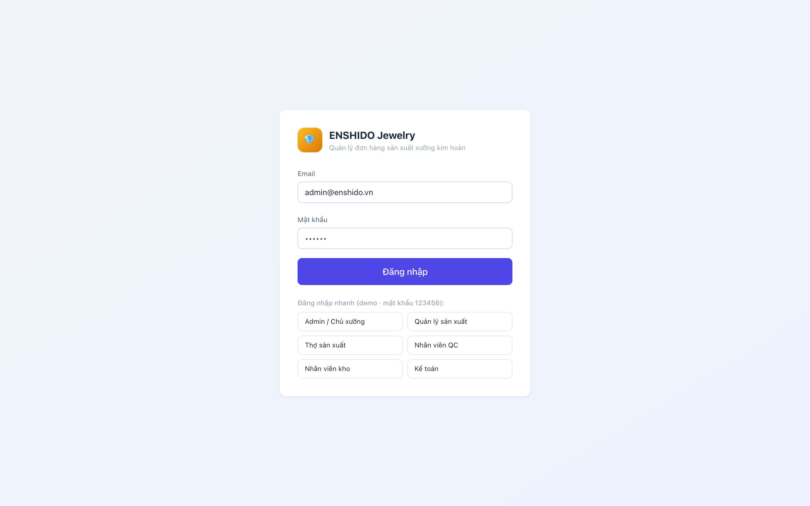

- Đăng nhập JWT (access + refresh), mật khẩu hash Argon2.
- **RBAC 6 vai trò** kiểm soát ở server: Admin/Chủ xưởng, Quản lý sản xuất, Thợ, QC, Kho, Kế toán.
- Nút "đăng nhập nhanh" cho 6 vai trò demo; tài khoản nghỉ việc bị **khóa** (không xóa cứng).

### 2.2. Dashboard (US10 + nâng cao US6/003)

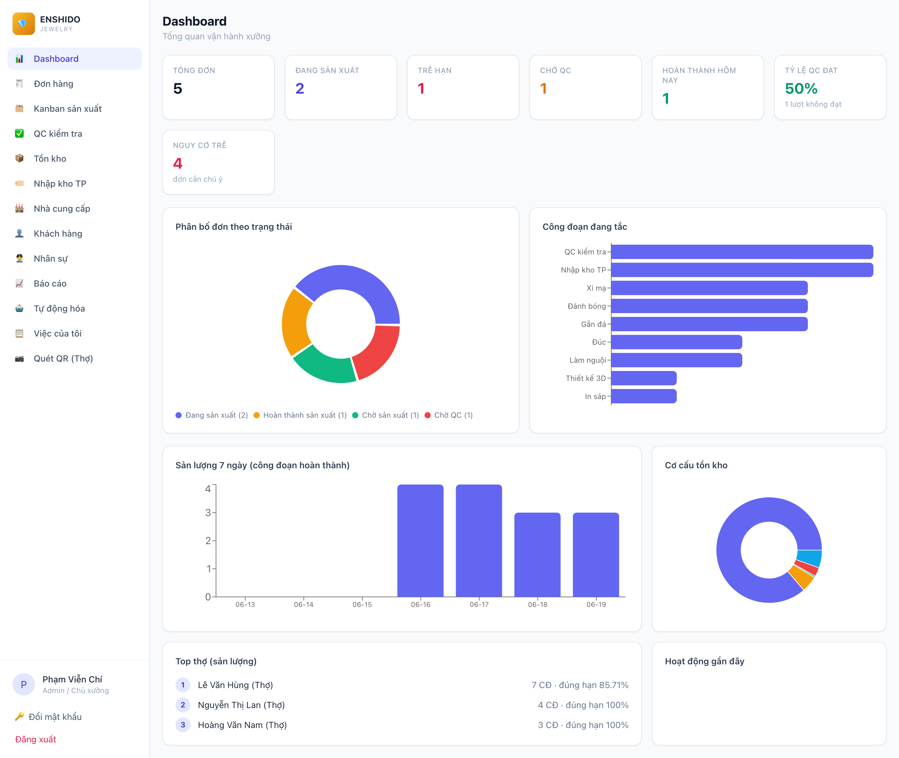

- 6 thẻ chỉ số: tổng đơn, đang sản xuất, trễ hạn, chờ QC, hoàn thành hôm nay, **tỷ lệ QC đạt**.
- Biểu đồ **phân bố đơn theo trạng thái** (donut) + **công đoạn đang tắc** (bar).
- **Nâng cao (Phase 003)**: sản lượng 7 ngày, cơ cấu tồn kho, top thợ, hoạt động gần đây.
- Tự cập nhật realtime khi thợ báo xong công đoạn.

### 2.3. Danh sách đơn hàng (US3)

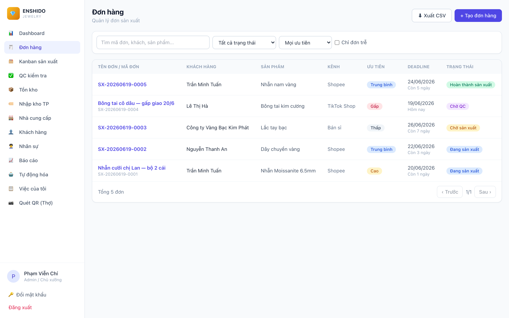

- Lọc theo trạng thái, tìm theo mã đơn/khách/sản phẩm, phân trang.
- Badge trạng thái + ưu tiên; cảnh báo deadline (trễ N ngày).

### 2.4. Tạo đơn hàng (US3)

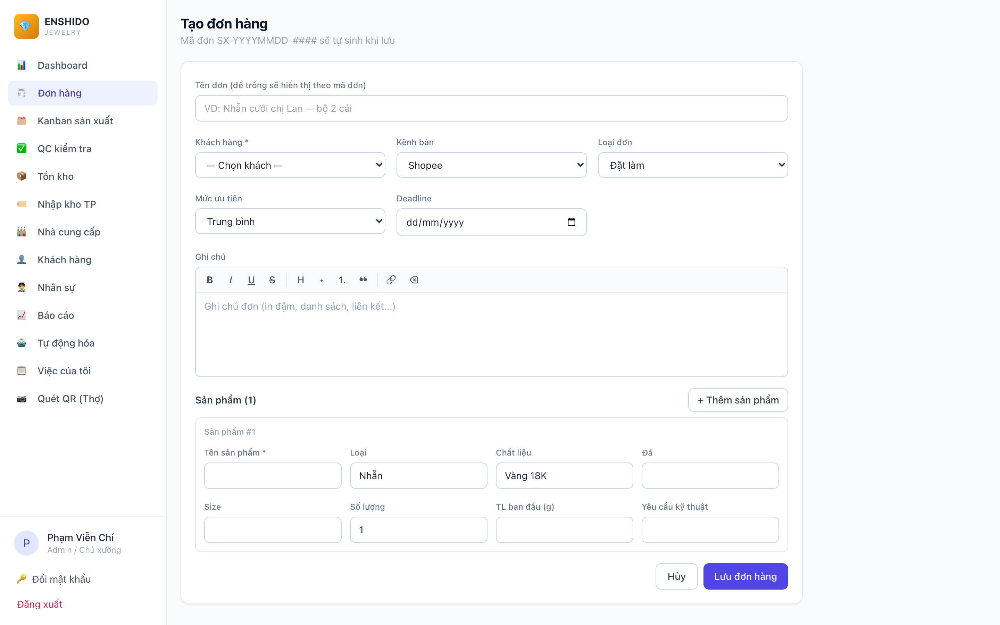

- Chọn khách, kênh bán, loại đơn, ưu tiên, deadline; thêm **nhiều sản phẩm** (chất liệu, đá, size, TL ban đầu, yêu cầu kỹ thuật).
- Sinh mã `SX-YYYYMMDD-####` khi lưu.

### 2.5. Chi tiết đơn — quy trình, trọng lượng, QC, nhật ký (US3/US4/US5/US7)

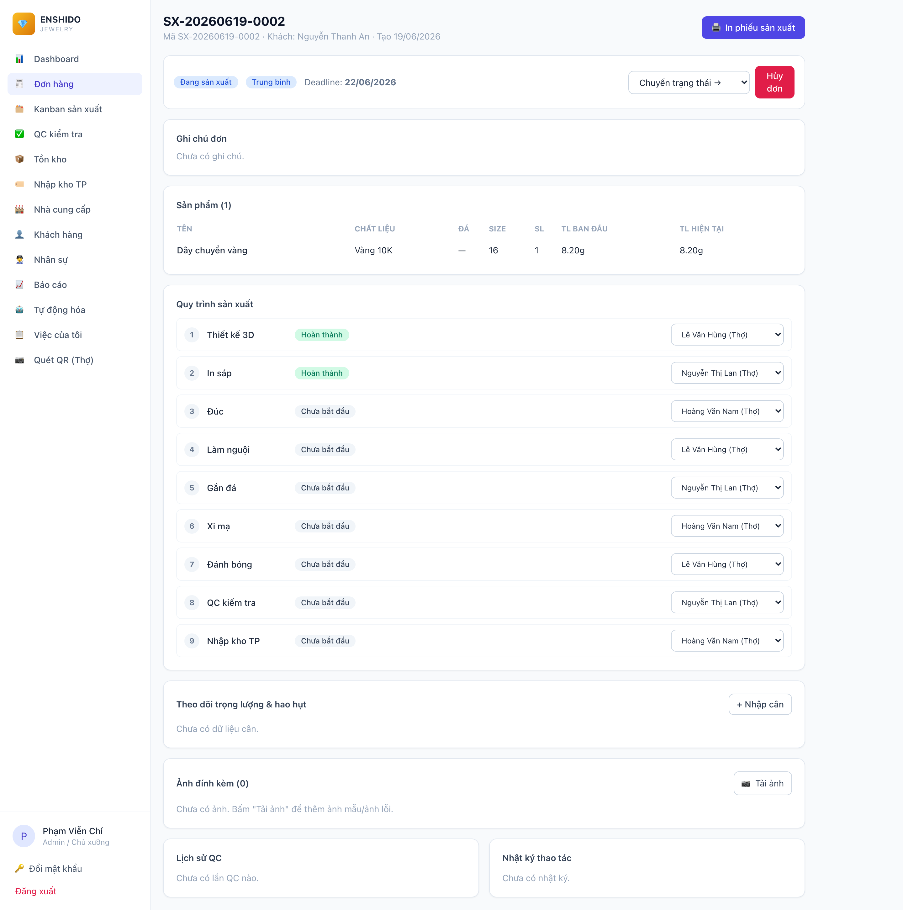

- Thông tin đơn + **state-machine trạng thái** (chỉ cho phép chuyển hợp lệ) + nút **In phiếu sản xuất** (QR) và **Hủy đơn** (vô hiệu QR).
- **Cấu hình công đoạn** & gán thợ cho từng bước.
- Bảng **theo dõi trọng lượng & hao hụt** (hao hụt g/%, lũy kế, tô đỏ khi vượt định mức).
- **Lịch sử QC** nhiều lần + **Nhật ký thao tác** (ai – làm gì – khi nào, append-only).

### 2.6. Kanban — Bảng trạng thái đơn hàng (US9 + tinh chỉnh 006)

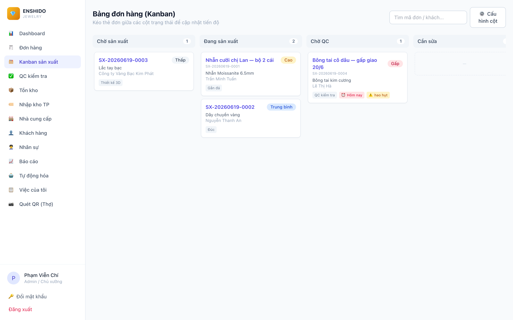

- **Cột = trạng thái ĐƠN HÀNG** (Todo/Doing/Done: Chờ SX · Đang SX · Chờ QC · Cần sửa · Hoàn thành SX · Đã nhập kho).
- Kéo–thả thẻ đơn giữa cột → **đổi trạng thái đơn** (validate state-machine, chặn chuyển sai) + ghi nhật ký.
- **Cột cấu hình được** (⚙️ thêm/ẩn/đổi tên/sắp xếp). Thẻ hiển thị công đoạn hiện tại + cảnh báo trễ/hao hụt; realtime.
- *(Tinh chỉnh Phase 006: thay thế bản Kanban-theo-công-đoạn cũ.)*

### 2.7. QC kiểm tra — Phiếu kiểm theo bộ tiêu chí (US8 + nâng cấp 009)

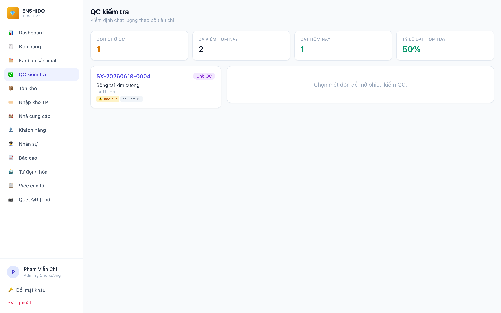

- **Thanh thống kê** (đơn chờ QC, đã kiểm hôm nay, tỷ lệ đạt) + danh sách đơn chờ.
- **Phiếu kiểm** đầy đủ: thông tin SP (ảnh, chất liệu, đá, size, **trọng lượng + % hao hụt có cảnh báo**) + **bộ 8 tiêu chí kiểm** (Đạt/Lỗi/Bỏ qua, tiêu chí nghiêm trọng đánh dấu ●).
- 3 kết quả **Đạt / Cần sửa / Không đạt**; khi lỗi: loại lỗi (gợi ý theo tiêu chí), mức độ, **công đoạn trả về**, giao thợ sửa, deadline, **ảnh lỗi** → đơn về "Cần sửa" đúng công đoạn, đếm số lần làm lại.
- **Kiểm theo từng sản phẩm** + **lịch sử kiểm** (kết quả/lỗi/ảnh) hiển thị ngay. *(Nâng cấp Phase 009 — xem §4f.)*

### 2.8. Khách hàng (US2) + chi tiết khách (006)

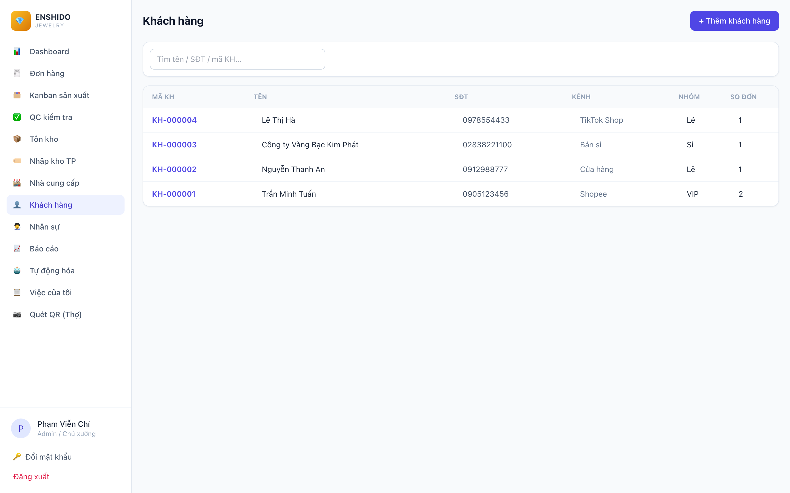

- CRUD khách, sinh mã `KH-######`, kênh bán/nhóm khách, đếm số đơn theo khách.

**Trang chi tiết khách + lịch sử đơn** (tinh chỉnh 006):

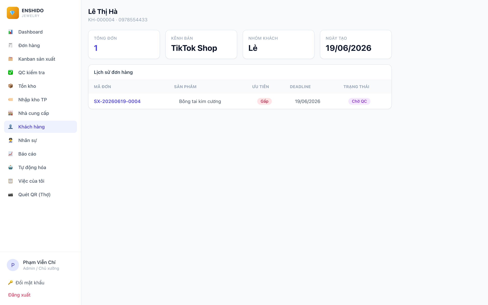

> Tinh chỉnh 006 cho **Quản lý đơn**: thêm **form sửa đơn + sản phẩm** (khi đơn chưa vào SX), **upload ảnh** mẫu/lỗi ở chi tiết đơn, **lọc nâng cao + Xuất CSV** danh sách đơn.

### 2.9. Màn hình thợ — quét QR (mobile, US6)

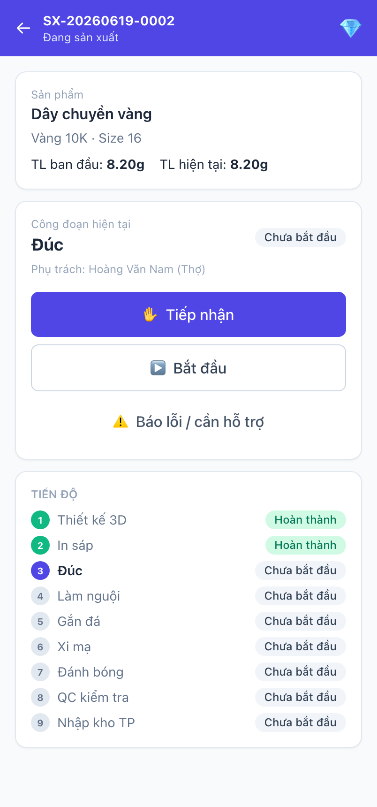

- Mobile-first, **nút lớn một tay**: Tiếp nhận → Bắt đầu → Hoàn thành (nhập SL + trọng lượng, preview hao hụt realtime) → Báo lỗi.
- Yêu cầu đăng nhập khi quét; chống ghi đè đồng thời (optimistic lock); tiến độ công đoạn trực quan.

---

## 3. Phase 002 — Tồn kho (Inventory)

Vật tư/NCC → Nhập/Xuất/Chuyển kho → Nhập kho thành phẩm sau QC PASS → Cảnh báo & định giá.

### 3.1. Quản lý tồn kho (US1/US2/US3/US5/US6/US7)

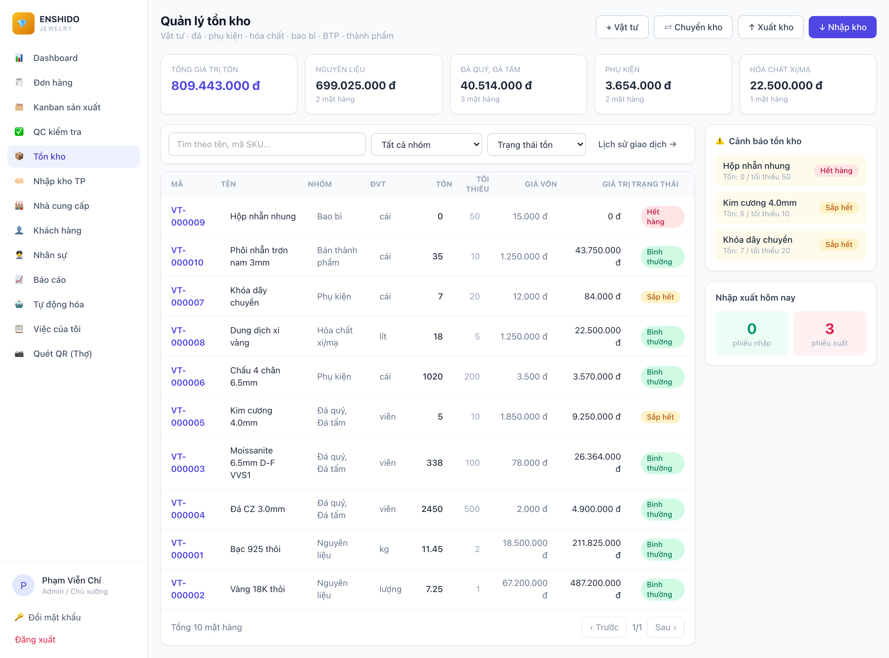

- Danh mục vật tư theo **7 nhóm kho** (nguyên liệu, đá, phụ kiện, hóa chất, bao bì, BTP, thành phẩm) + badge trạng thái (đủ/sắp hết/hết).
- Thẻ **tổng giá trị tồn** theo nhóm; panel **cảnh báo tồn tối thiểu**; nhập/xuất hôm nay.
- Thao tác **Nhập / Xuất (gắn đơn) / Chuyển kho** + lịch sử giao dịch (immutable). Xuất vượt tồn bị chặn.

### 3.2. Nhập kho thành phẩm sau QC PASS (US4)

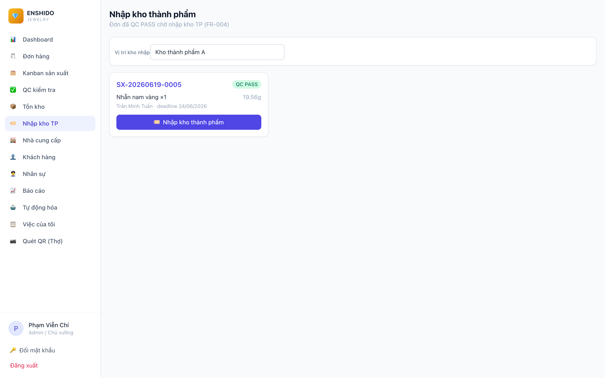

- Hàng chờ = đơn đã **QC PASS**; nhập kho → tạo vật tư nhóm Thành phẩm, đơn chuyển trạng thái **"Đã nhập kho TP" (STOCKED)** — khép kín luồng từ Phase 001.

### 3.3. Nhà cung cấp

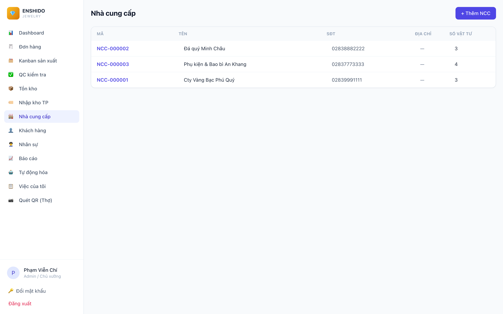

- CRUD NCC, sinh mã `NCC-######`, đếm số vật tư theo NCC; gắn vào phiếu nhập.

---

## 4. Phase 003 — Báo cáo & Phân tích

Trang **Báo cáo** có bộ lọc khoảng ngày + 6 tab, mỗi tab gồm biểu đồ + bảng, kèm **Xuất CSV** và **In PDF**. Số liệu tổng hợp trực tiếp từ dữ liệu vận hành (khớp 100% nguồn — SC-001).

### 4.1. Báo cáo đơn hàng & sản xuất (US1)

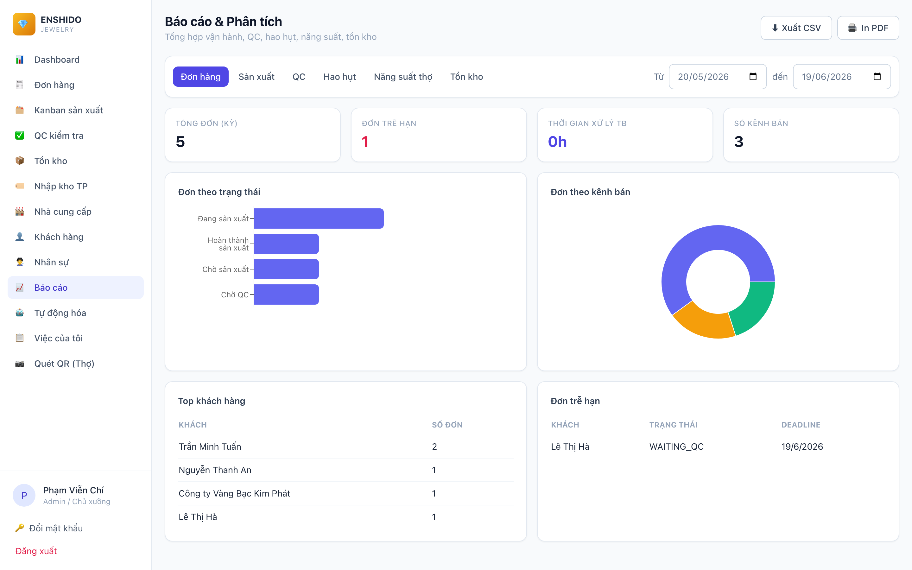

- Đơn theo trạng thái/kênh/khách, đơn trễ, thời gian xử lý TB; sản lượng theo ngày, theo công đoạn, công đoạn tắc, thời gian TB mỗi công đoạn.

### 4.2. Báo cáo hao hụt trọng lượng (US3)

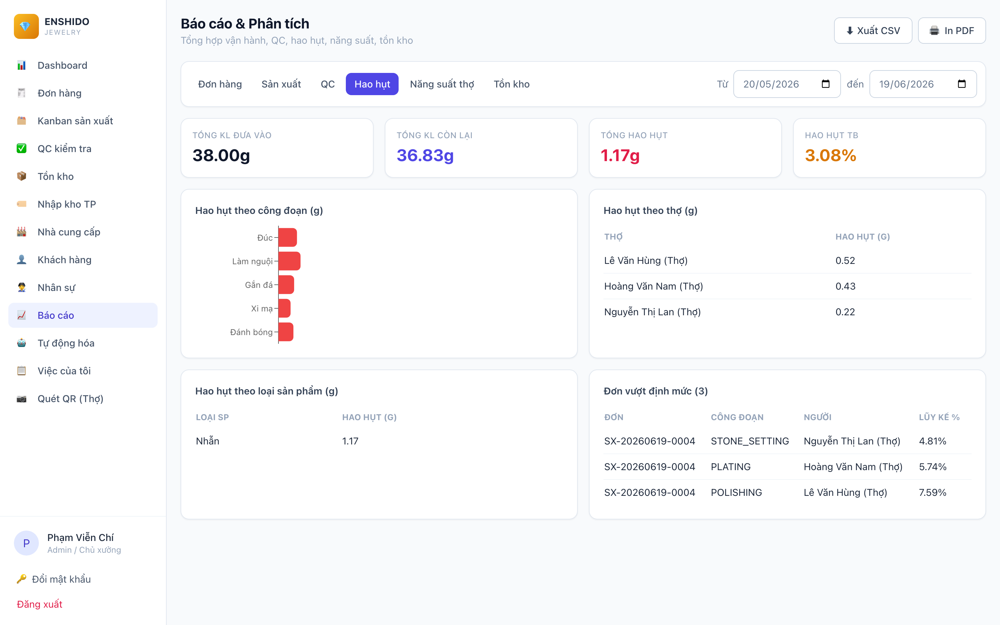

- Tổng kim loại vào/còn lại/hao hụt + tỷ lệ TB; hao hụt theo công đoạn/thợ/loại sản phẩm; **danh sách đơn vượt định mức** (công đoạn + người + lũy kế %).

### 4.3. Báo cáo tồn kho (US5)

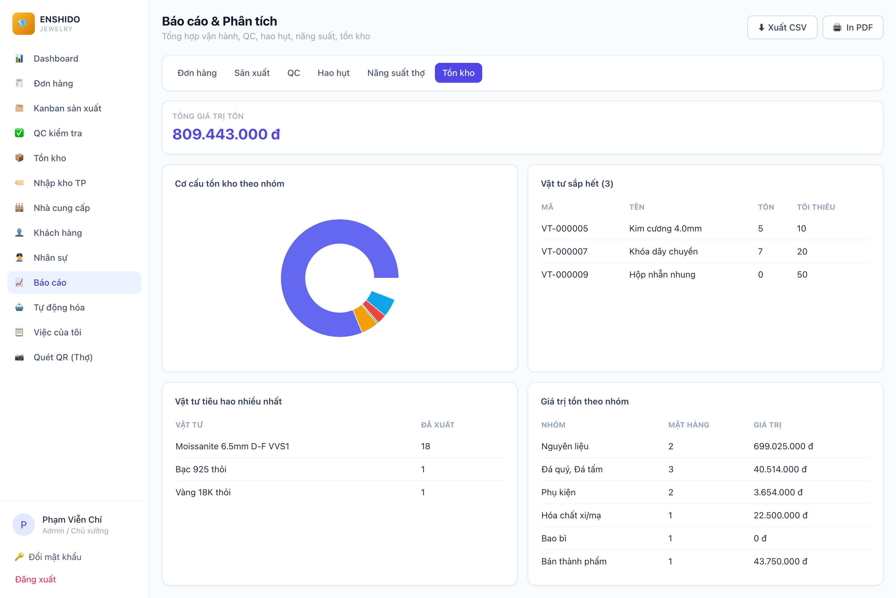

- Cơ cấu tồn kho theo nhóm (donut), tổng giá trị tồn, vật tư sắp hết, **vật tư tiêu hao nhiều nhất**.
- *(Các tab khác: QC — tỷ lệ pass/fail + phân rã lỗi; Năng suất thợ — xếp hạng đúng hạn/tỷ lệ lỗi.)*

---

## 4b. Phase 004 (P1) — Nhân sự & Công việc theo tháng

### Quản lý nhân sự (US1)

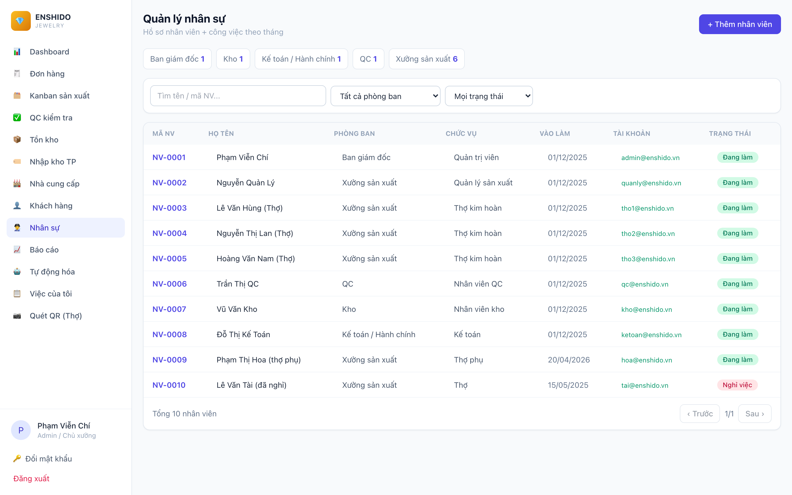

- Hồ sơ nhân viên là **bảng riêng** (`employees`, mã `NV-####`); **mọi NV đều có tài khoản** (cập nhật bởi 007 — xem §4d). `users.employeeId` liên kết 1–1.
- Lọc phòng ban/chức vụ/trạng thái + thống kê theo phòng ban; nghỉ việc → **khóa tài khoản** liên kết nhưng **giữ dữ liệu lịch sử**.

### Công việc theo tháng của nhân viên (US6 — trọng tâm review)

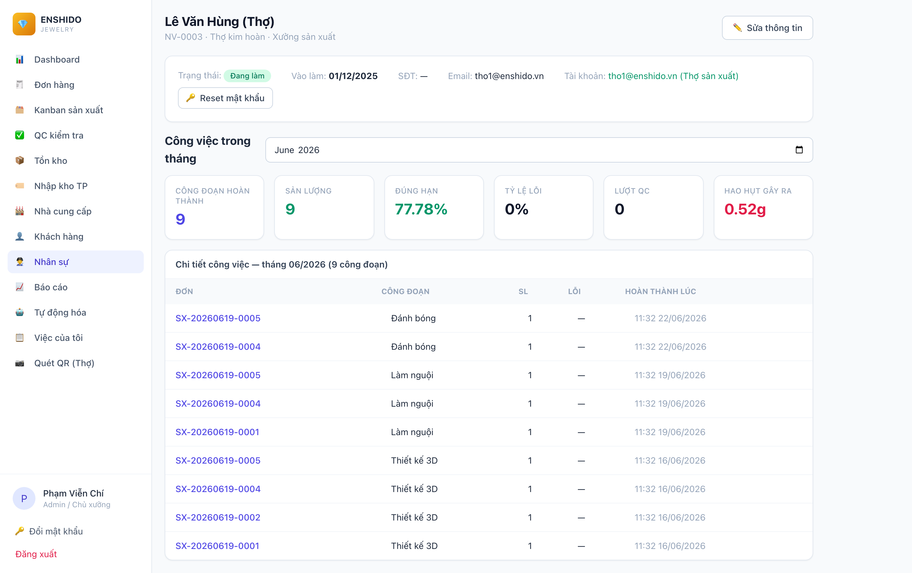

- Chọn tháng → tổng hợp: **công đoạn hoàn thành, sản lượng, % đúng hạn, % lỗi, lượt QC, hao hụt gây ra** + **bảng chi tiết** từng công đoạn (đơn, công đoạn, SL, thời điểm).
- Số liệu **khớp 100%** với báo cáo năng suất (003) cho cùng kỳ (SC-005, có test tự động đối chiếu).

> Phần còn lại của 004 (P2): phân quyền nâng cao, chấm công/ca, khung lương — chưa làm.

---

## 4c. Phase 005 — Tự động hóa & Tích hợp (rule-based)

Trang **Tự động hóa** có 5 tab; mọi ngưỡng/đơn giá **cấu hình được** (nút ⚙️ Cấu hình luật — FR-006).

### Cảnh báo trễ đơn + Gợi ý phân công (US1/US2)

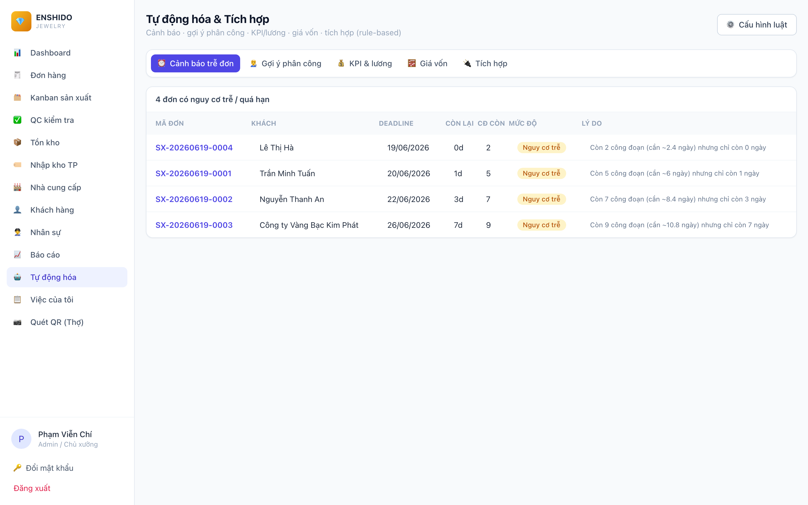

- **Cảnh báo trễ**: đơn nguy cơ trễ/quá hạn dựa trên (số công đoạn còn lại × ngày TB × hệ số) vs thời gian còn lại + lý do; hiện cả số liệu trên Dashboard.
- **Gợi ý phân công**: xếp hạng thợ theo **tải việc** + **khớp kỹ năng**.

### KPI & lương theo sản lượng (US3) + Giá vốn (US4)

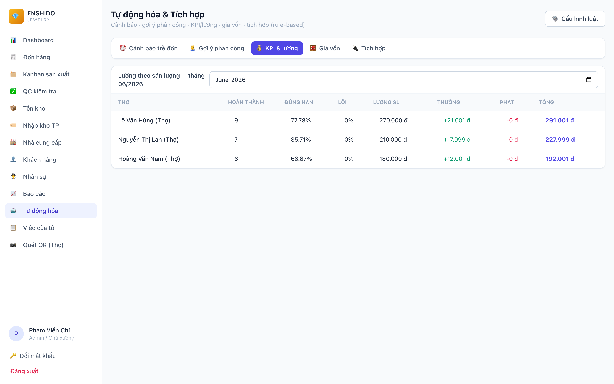

- **KPI/lương**: theo thợ/tháng — lương sản lượng + thưởng đúng hạn − phạt lỗi (truy ngược báo cáo 003).
- **Giá vốn**: phân rã **3 thành phần** = vật tư (xuất kho) + công thợ + hao hụt kim loại (đổi đơn giá ở Cấu hình → giá vốn đổi theo).
- **Tích hợp** (P3, stub): Shopee + kế toán MISA — đồng bộ có nhật ký **idempotent** (đồng bộ lại trong ngày → SKIPPED).

---

## 4d. Phase 007 — Account-per-Employee & Tín công theo người thực hiện

> Tinh chỉnh theo yêu cầu: **(1) mỗi nhân sự đều có tài khoản; (2) ai quét QR & thao tác thì được tính công khâu đó.**

- **Mỗi NV có account**: tạo nhân viên → **tự cấp tài khoản** (email + vai trò + **mật khẩu ngẫu nhiên** hiện 1 lần); Admin có nút **Reset mật khẩu**; danh sách NV (ảnh §4b) không còn ai "Không có tài khoản". Endpoint `provision-accounts` cấp bổ sung cho NV cũ.
- **Tín công theo người thực hiện**: `production_steps.performedById` = người **quét QR & thao tác** (≠ người được gán nếu khác). Worklog (004) + năng suất (003) + KPI/lương (005) **đều tính theo người thực hiện thực tế**; chi tiết đơn hiển thị "Thực hiện: X" khi khác người gán.
- Verify tự động: thợ B (khác người gán A) hoàn thành công đoạn → công tính cho **B**; worklog ↔ năng suất ↔ KPI khớp.

---

## 4e. Phase 008 — Review fixes (UX · RBAC · Worker)

Từ đợt rà soát tính năng cũ, đã sửa/bổ sung:
- **Tự gia hạn phiên**: hết access token (15') → client tự dùng refresh token, không văng đăng nhập giữa chừng.
- **QC đính kèm ảnh lỗi**: màn QC FAIL có tải ảnh → lưu vào bản ghi QC.
- **"Việc của tôi"** cho thợ: liệt kê công đoạn đang giao + mở quét nhanh (thợ đăng nhập vào thẳng màn này).
- **Tự đổi mật khẩu** (mọi vai trò) ở thanh user.
- **Siết RBAC đọc**: Thợ không còn đọc/tải toàn bộ đơn (`GET /orders` → 403); chỉ dùng my-tasks + scan.
- **Nhập trọng lượng trên desktop** (Quản lý/QC) ngay ở chi tiết đơn.
- **Phân trang** Tồn kho & Nhân sự; thêm `api/.env.example` cho onboarding.

---

## 4f. Phase 009 — Nâng cấp nghiệp vụ QC (Phiếu kiểm)

Từ yêu cầu "tab QC quá đơn giản, không tương tác được":
- **Sửa bug gốc**: component `Card` không forward `onClick` → thẻ đơn QC trước đây **không bấm được**. Đã sửa (ảnh hưởng mọi thẻ dùng Card).
- **Phiếu kiểm QC** (ảnh §2.7): thông tin SP đầy đủ + trọng lượng/hao hụt cảnh báo; **bộ 8 tiêu chí kiểm** kim hoàn (trọng lượng, kích thước, gắn đá, xi mạ, đánh bóng, đúc, khớp mẫu, hoàn thiện) chọn Đạt/Lỗi/Bỏ; 3 kết quả Đạt/Cần sửa/Không đạt; ảnh lỗi; **kiểm theo từng SP**; **lịch sử kiểm**; thanh thống kê QC.
- Backend: `qc_records.checklist` lưu kết quả tiêu chí; `GET /qc/stats`.

---

## 4g. Phase 010 — Tên đơn · Ghi chú rich content · Sửa hồ sơ NV

Từ 3 yêu cầu tinh chỉnh của người dùng:

**1. Tên đơn dễ đọc (mặc định = mã đơn).** Thêm `Order.name` (tùy chọn) + helper dùng chung `orderDisplayName(o) = name || code`. Đặt tên khi tạo/sửa đơn; hiển thị ở **danh sách, tiêu đề chi tiết, thẻ Kanban, phiếu in** (mã đơn vẫn hiển thị phụ + là khóa tìm kiếm). Bỏ trống → hiển thị mã.

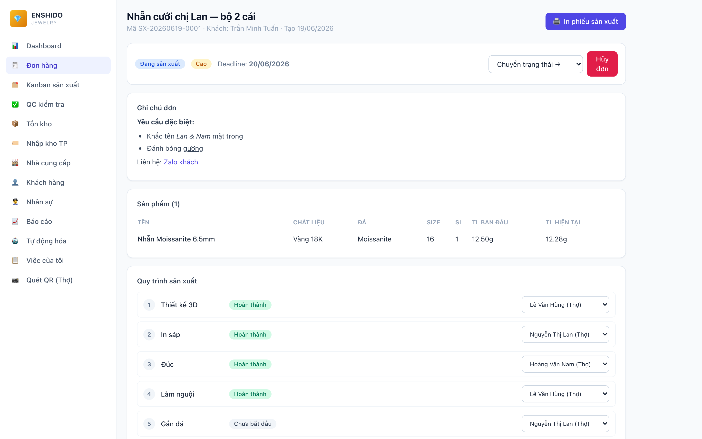

**2. Ghi chú rich content (TipTap WYSIWYG).** Trước đây ghi chú nhập 1 dòng và **không hề hiển thị** ở chi tiết. Nay soạn bằng **TipTap** (đậm/nghiêng/gạch chân/gạch ngang, danh sách chấm & số, tiêu đề, trích dẫn, **liên kết**) và hiển thị có định dạng ở chi tiết đơn. **An toàn (Hiến pháp VI)**: server **sanitize** HTML về whitelist hẹp — loại bỏ `<script>`, thuộc tính `on*`, `href="javascript:"`… (kiểm chứng ở self-test §43).

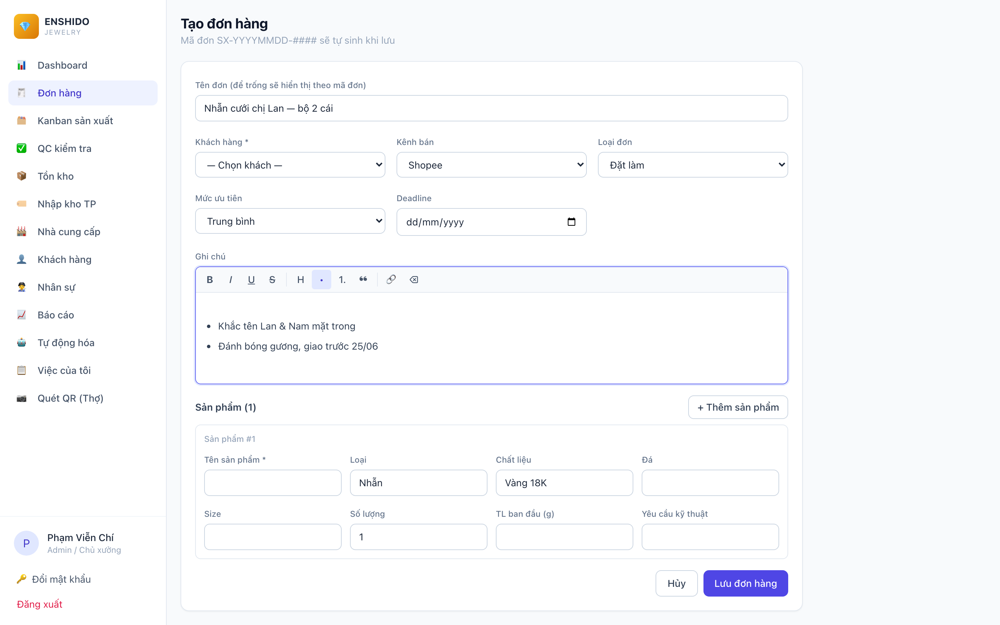

**3. Sửa hồ sơ nhân viên từ giao diện.** Backend đã có `PUT /employees/:id`; bổ sung nút **"✏️ Sửa thông tin"** (Admin/Kế toán) mở form điền sẵn. Đổi họ tên sẽ **đồng bộ tên tài khoản đăng nhập** liên kết.

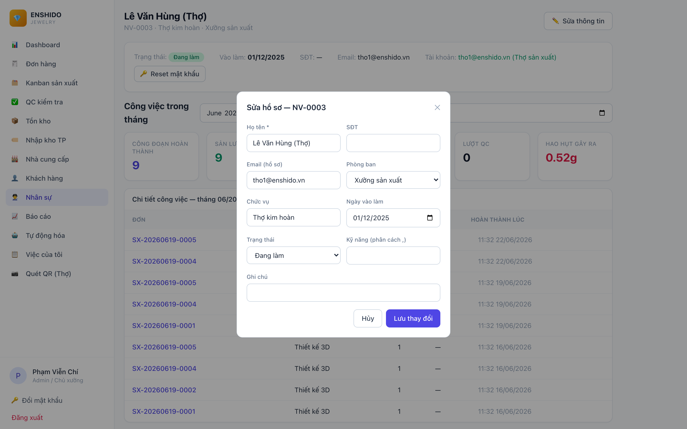

- Backend: `Order.name` + `sanitizeRichText()` (common); `orders.list/board` tìm theo tên; `employees.update` đồng bộ `user.name`.
- Bundle: TipTap chỉ nạp ở 3 route soạn thảo (`/orders/new`, `/edit`, `/[id]` ~240–254 kB); trang xem dùng `RichTextView` thuần → không tăng bundle.

---

## 4h. Phase 011 — Lô sản xuất (Đúc / Xi mạ theo mẻ)

Nghiệp vụ: Đúc/Xi mạ làm **theo lô nhiều đơn một lúc**; cân chênh lệch **theo cả lô**, không từng cái — nhưng hao hụt/giá vốn/KPI vẫn phải đúng **từng đơn** (Hiến pháp III).

**Cách xử lý**: gom đơn vào **lô** (quét QR hoặc chọn từ danh sách đơn đang chờ) → **cân tổng cả lô (1 số)** → hệ thống **tự phân bổ chênh lệch về từng đơn theo tỉ lệ khối lượng** (cho **sửa tay** đơn cá biệt) → ghi một bản cân **bất biến** cho mỗi đơn, hoàn thành công đoạn cho tất cả và tín công người chạy lô.

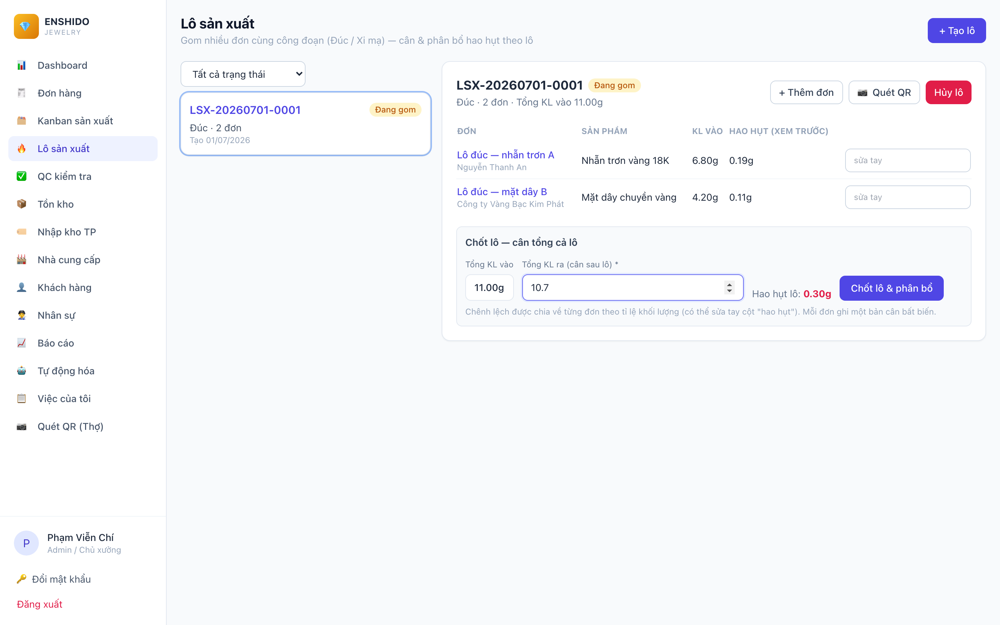

- **Bảo toàn khối lượng**: `Σ hao hụt phân bổ = hao hụt lô` (phần dư làm tròn dồn vào đơn nặng nhất); hỗ trợ **tăng cân** (xi mạ → hao hụt âm).
- Hàm `allocateBatchLoss()` dùng **chung** cho xem trước (client) và chốt lô (server). Backend: `ProductionBatch` + `ProductionStep.batchId`; chốt lô tái dùng `WeightService` (weight_log per-đơn) + luồng hoàn thành công đoạn per-đơn.
- Công đoạn chạy theo lô **cấu hình được** (mặc định Đúc + Xi mạ). RBAC: Thợ + Quản lý (+ Admin).

### 011b — Kanban theo công đoạn (bổ sung)
Ngoài bảng Kanban **theo trạng thái đơn**, thêm **chế độ xem "theo công đoạn"** (nút chuyển): cột = 9 công đoạn quy trình, mỗi đơn nằm ở **công đoạn hiện tại** (thẻ hiện tiến độ X/9 + cờ "🔥 trong lô"). **Kéo thẻ sang công đoạn kế = đánh dấu hoàn thành** công đoạn (thao tác nhanh của quản lý). Giữ nguyên bảng theo trạng thái đơn (Phase 006).

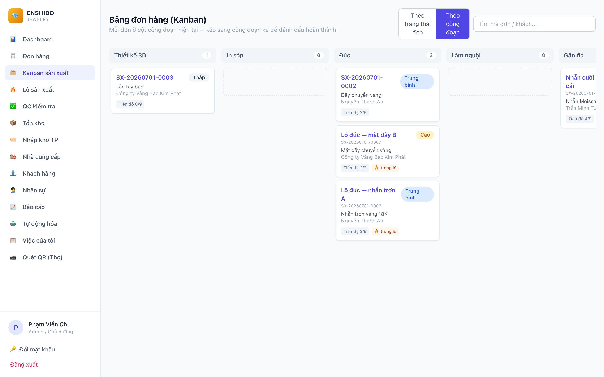

---

## 4i. Phase 012 — Tinh chỉnh Trọng lượng & QC (MVP)

**A. Theo dõi trọng lượng & hao hụt (đơn hàng)**
- Công đoạn hiển thị **tiếng Việt** (sửa seed lưu nhãn thay vì mã enum + map ở UI).
- Form nhập cân: **chọn công đoạn** (dropdown công đoạn của đơn) + **chọn người cân** (thay vì mặc định người thao tác).
- **Trùng công đoạn = chỉnh sửa**: bảng gộp **1 dòng/công đoạn** (số mới nhất), có "đã cân N×" mở lịch sử; **weight_logs vẫn append-only** (giữ Hiến pháp III).

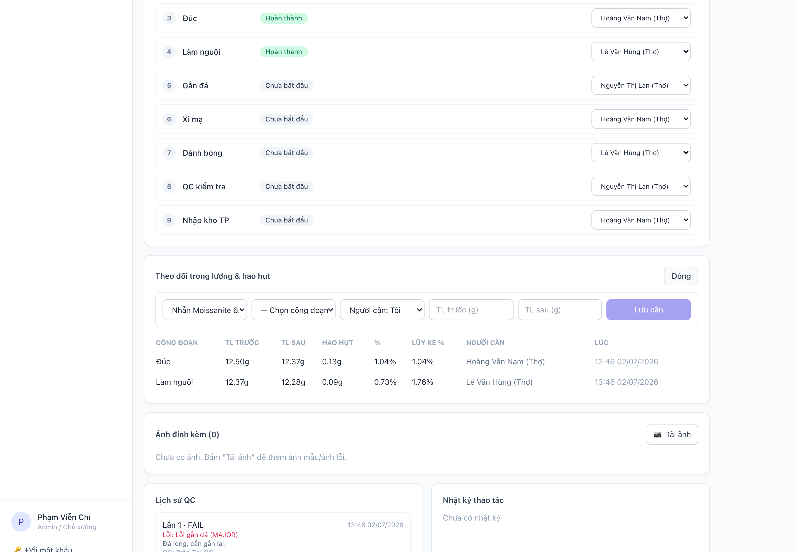

**B. QC — form trả lỗi rút gọn cho MVP**
- Giữ **bộ 8 tiêu chí**. Khi bấm "Cần sửa / Không đạt", form chỉ còn **Tên lỗi (text) + Mô tả (rich text) + Ảnh (tùy chọn)** — bỏ mức độ/công đoạn trả về/giao thợ/deadline.
- **Server tự chọn công đoạn trả về** (công đoạn SX vừa xong gần nhất) → đơn vẫn về "Cần sửa" đúng chỗ; mô tả lưu **rich text đã sanitize**.

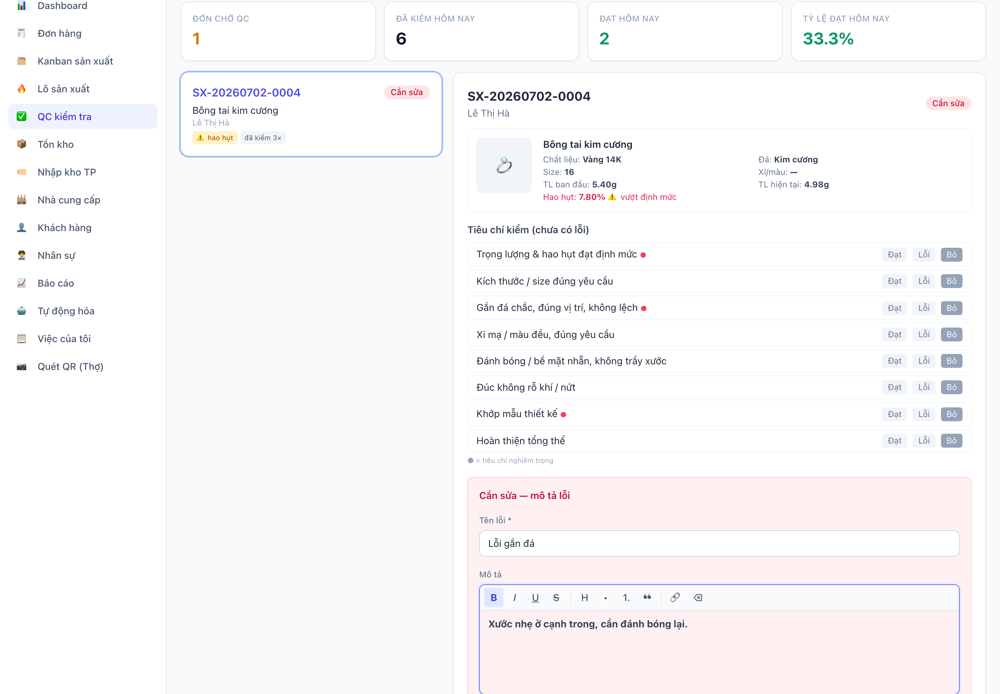

---

## 4j. Phase 013 — QR full-link · Gom lô khi quét · KL tiếp nhận

**A. QR quét được từ điện thoại/app ngoài.** QR trên phiếu nhúng **URL đầy đủ dùng IP LAN** (dev, vd `http://192.168.1.13:3000/scan/…`) thay vì `localhost` — và **hiển thị URL đích** dạng text/link dưới QR. Ưu tiên `PUBLIC_WEB_ORIGIN` (domain/IP cố định) nếu đặt.

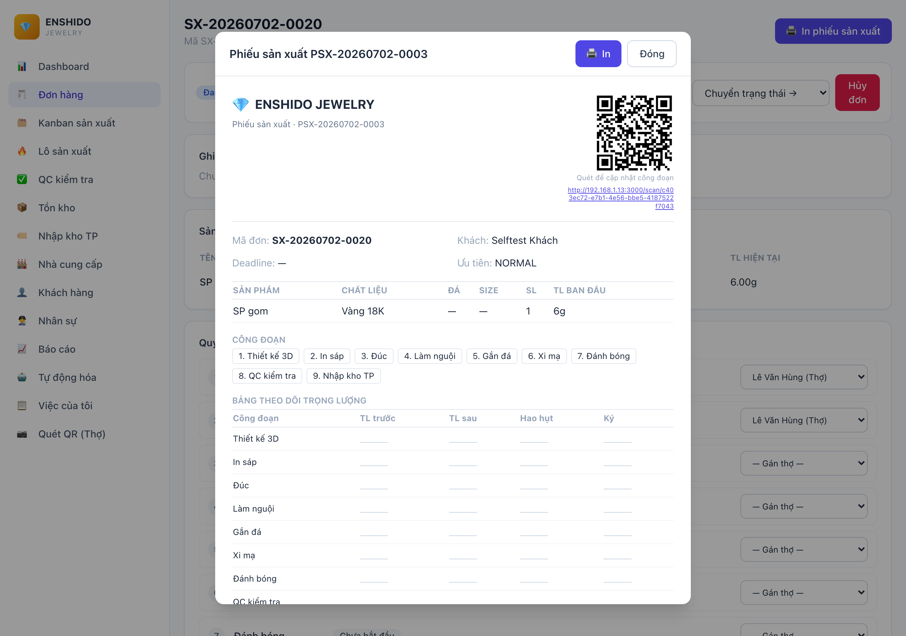

**B. Gom đơn thành lô khi quét (thợ).** Màn quét có chế độ **Gom lô**: quét **liên tục nhiều QR** → hệ thống lấy công đoạn hiện tại của đơn đầu (Đúc/Xi mạ) → **tự tạo lô** & gom; các QR sau gom tiếp; điều hướng sang trang Lô để chốt. Tái dùng API Lô (Phase 011).

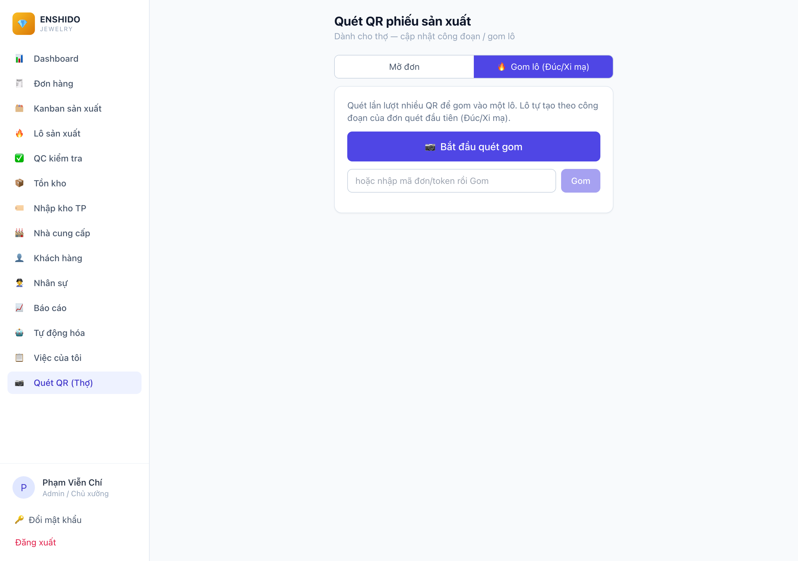

**C. Cập nhật KL tiếp nhận khi quét.** Khi **Tiếp nhận** công đoạn, thợ có thể nhập **KL tiếp nhận (tùy chọn)** → ghi 1 bản cân "Tiếp nhận – <công đoạn>", cập nhật TL hiện tại của SP.

- Không đổi schema. QR vẫn là **token** (không nhúng dữ liệu nhạy cảm — Hiến pháp VI).

---

## 5. Bản đồ tuân thủ Hiến pháp dự án

| Nguyên tắc | Triển khai |
|---|---|
| I. RBAC least-privilege | Guard + `@Roles()` mọi endpoint; menu lọc theo vai trò |
| II. Audit immutable | `activity_logs` & `inventory_transactions` chỉ ghi-thêm |
| III. Toàn vẹn hao hụt | Công thức chuẩn chia sẻ FE/BE, test 6/6; `weight_logs` bất biến; cảnh báo vượt định mức |
| IV. Mobile-first thợ | Màn hình quét QR nút lớn, một tay |
| V. Spec-driven | Làm P1 trước, theo tasks.md từng phase |
| VI. Security | JWT, Argon2, QR token (vô hiệu khi hủy đơn), kiểm soát upload |
| VII. Performance & realtime | Phân trang + index; Socket.IO cho Kanban/Dashboard/Kho |

---

## 6. Cách chạy & kiểm thử

```bash
npm install
npm run db:migrate && npm run db:seed
npm run dev          # Web :3000 · API :4000 (Swagger /api/docs)
npm run selftest     # 212 kiểm tra E2E
npm test             # 6 unit test hao hụt
```

Tài khoản demo (mật khẩu `123456`): `admin@enshido.vn`, `quanly@enshido.vn`, `tho1@enshido.vn`, `qc@enshido.vn`, `kho@enshido.vn`, `ketoan@enshido.vn`.

> Ảnh trong báo cáo này được chụp tự động bằng Playwright từ hệ thống đang chạy (`node scripts/shots.mjs`). Phase tiếp theo: 004 HR & Workforce · 005 Automation & Integrations.
